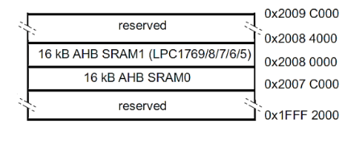

## Ejercicio parcial 1
# SProgramar el microcontrolador LPC1769 en un codigo en lenguaje c, con una frecuencia de cclk de 80Mhz, para que mediante una interrupcion externa en el pin p2.10 por flanco ascendente, se comande secuencialmente las siguientes funcionalidades:
- Mediante el ADC se debe digitalizar una senial analogica cuyo ancho de banda es de 80KHz y su amplitud de pico maxima positiva de 3,3v:
1) Los datos deben ser guardados, cada 1 segundo, utilizando punteros (ADC_POINTER).
2) Los datos deben ser guardados, cada 1 segundo, utilizando el hardware GPDMA (ADC_DMA).
En ambos casos, desde la primera mitad de la memoria SRAM ubicada en el bloque AHB SRAM-bank 0 de manera tal que permita almacenar todos los datos posibles que esta memoria permita, mediante un buffer circular.

